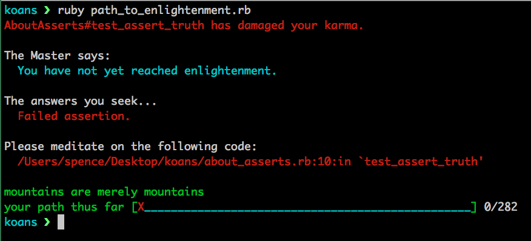
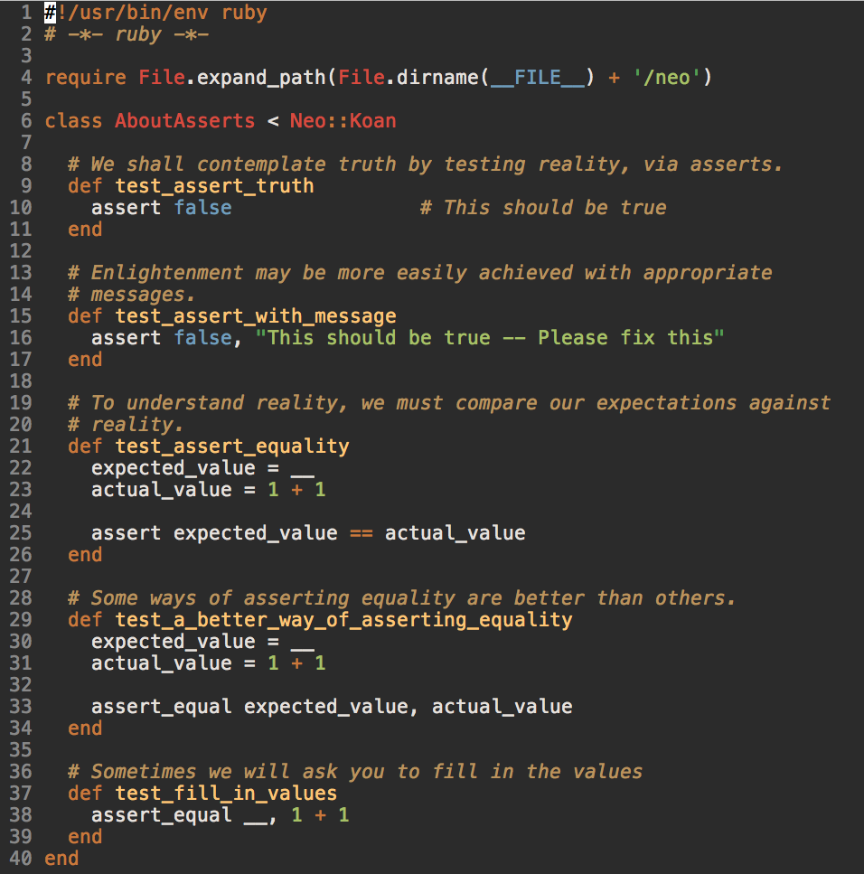
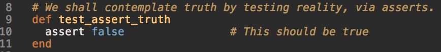
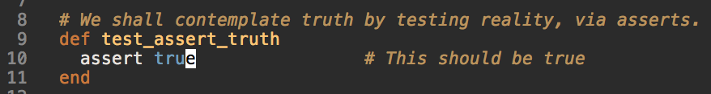
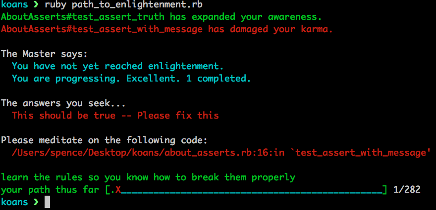

## Ruby Koans

Ruby koans are an extremely powerful tool to start learning the Ruby language on
a deeper level.  Koans consist of 282 tests that you need to make pass in order
to reach enlightenment.  They progressively get harder and more complex.

### Setup

-  [Visit this link and click on the red button "Download The
    Koans"](http://rubykoans.com/)  
-  In your downloads folder click on the file "rubykoans.zip"  

After you unzip the file it should create a koans folder.  Move that koans
folder to wherever you keep your programs or somewhere accessible like your
Desktop.

`cd` into your koans directory and then run: `ruby path_to_enlightenment.rb`

This is the main command you will be running in order to work your way through
all the koans.

Here is what you should see the first time running the command:

Lets break this image down into the separate components:

-  At the bottom is your progress bar.  Currently we have passed 0/282 tests.  
-  Right above the progress bar is the line "Please meditate on the following
    code:".  This is your cue as to where to go to keep progressing through the
    koans.  The line in red shows you the path to the proper file to edit.  In
    this case we need to go to `koans/about_asserts.rb` and the error is on
    `line 10`.  
-  The next section tells you the answer you are trying to solve.  In this case
    we have a "Failed assetion" and we need to make it pass.  

Let's visit that `about_asserts.rb` file and see if we can make the test pass.

We should see this:

If we head on down to `line 10` we should see this method/test being called:

It's important to read through the comments in the test files as they give you
hints in order to solve the problem.

For this first test, the point is just to teach you how assertions work in
testing.  To make it pass we change it to `assert true` like this:

Now if we go back to our terminal and run `ruby path_to_enlightenment.rb` we
should see a new screen with the first test passing!

Notice how on the bottom right corner we have now completed 1/282 of the tests.
Keep repeating this process until you have made all 282 tests passing.  
